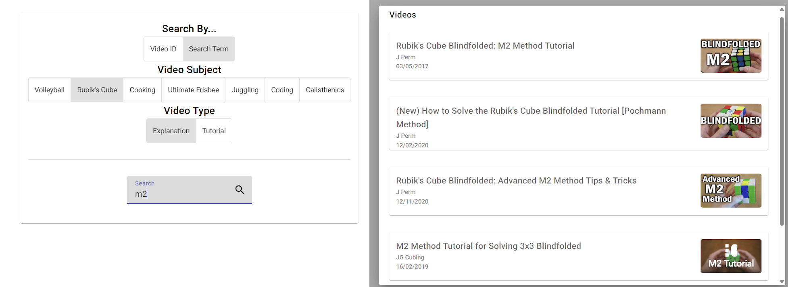

# YouTube Viewer App

## About This Project

This is an Angular web app for making searches on YouTube via the YouTube API. There are set search terms which can be included in search requests and the top results are shown. These videos are then viewable in the app. This app was created as an alternative to the YouTube website as it serves many suggested videos to the user which is not always wanted.

## Running This Project

To run this project, you must have node installed.

Open the youtube-viewer-app folder in your and run 'npm i' to install the node packages.

Then run 'npm generate environments' to generate the environment files. Add the YOUTUBE_API_KEY setting to the environment.ts file with a valid API Key.

Finally run 'npm run start' to serve the application.

